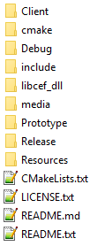

# GazeTheWeb - Browse

Gaze-controlled Web browser, part of the EU-funded research project MAMEM. There exists a deprecated prototype for initial testing purposes in [_Prototype_](Prototype) subfolder and the work in progress implementation of the full featured Web browser in the [_Client_](Client) subfolder. Both will only compile on either Windows with Visual Studio 2015 Update 3 as 32 bit project or on Linux with GCC 5.x as 64 bit project for the moment. In addition, your graphics card must support OpenGL 3.3 or higher (f.e. not the case for second generation Intel i-GPUs or lower, at least on Windows). Prototype build has been deactivated in the current version of the CMakeLists.

On a clean Ubuntu 17.04 installation, following packages are required:
* *git* (for cloning of repository including submodules)
* *cmake* (for generating the makefile)
* *build-essential* (GCC to compile the code)
* *xorg-dev* (libraries to create windows under X11 desktops)
* *libgl1-mesa-dev* (OpenGL development libraries)
* *libgconf2-4* (CEF needs to be linked against this)

## Videos
* [Demonstration](https://www.youtube.com/watch?v=x1ESgaoQR9Y)
* [Demonstration of prototype](https://www.youtube.com/watch?v=zj1u6QTmk5k)

## News
* [Announcement on official MAMEM page](http://www.mamem.eu/gazetheweb-prototype-for-gaze-controlled-browsing-the-web)
* [First user experience](http://www.mamem.eu/mamem-meets-three-remarkable-women)

## HowTo
Since the CEF3 binaries for Windows and Linux do not like each other, one has to copy them manually into the cloned project. Just follow these easy steps:

1. Clone this repository.
2. Download either Windows 32bit or Linux 64bit CEF binaries in standard distribution from [here](http://opensource.spotify.com/cefbuilds/index.html)
 * Windows Version: CEF 73.1.12+gee4b49f+chromium-73.0.3683.75 / Chromium 73.0.3683.75
 * Linux Version: *currently not supported*
3. Extract the downloaded files and copy following content into the locally cloned repository:
 * include
 * libcef_dll
 * Release
 * Debug
 * Resources
 * README.txt
 * LICENSE.txt
 * **DO NOT** overwrite the provided CMakeLists.txt and the content of cmake folder.
4. Folder structure should look like this screenshot:
 * 
5. If prototype (probably not) should be built too, one has to include its subdirectory in the main CMakeLists, line 532.
6. Create a build folder somewhere and execute CMake to generate a project, which can be compiled.
7. Compile the project (with Visual Studio under Windows and make under Linux). Only release mode is supported as of now.
8. When starting the program you can use the voice command mode using the "`--voice-input`" commandline argument.

## Notes
This project uses the _Chromium Embedded Framework_. Please visit https://bitbucket.org/chromiumembedded/cef for more information about that project!
