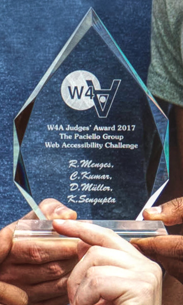

# GazeTheWeb



Software to access the Web using eyes and mind.

Download the latest release [**here**](https://github.com/MAMEM/GazeTheWeb/releases/latest).

## Cloning
This project uses Git submodules. Please check it out using:
```
git clone --recursive https://github.com/MAMEM/GazeTheWeb
cd GazeTheWeb
```
When submodules on remote are updated, one has to execute ```git submodule update``` manually.

## Projects
There are multiple subprojects in this repository:
* [**Browse**](Browse) Web browser controlled by your gaze.
* [**BrowseUpdater**](BrowseUpdater) Update tool for the browser.
* [**Tweet**](Tweet) Gaze-controlled Twitter application.
* [**Watch**](Watch) YouTube application with gaze and EEG signal processing.

Visit the [**wiki**](https://github.com/MAMEM/GazeTheWeb/wiki) for troubleshooting.

## Public
* Winner of the TPG Accessibility Challenge Judges' Award at the [Web For All 2017](http://www.w4a.info/2016/2017) in Perth, Australia. Read the corresponding paper [here](Browse/media/W4A17-p19-WeST.pdf).
* Honourable mention for the technical approach at the [WWW 2017](http://www2017.com.au) conference in Perth, Australia. Read the corresponding paper [here](Browse/media/WWW17-p219-WeST.pdf).
* Third place in the Digital Imagination Challenge by Unitymedia. See [here](https://twitter.com/Unitymedia_News/status/964441841943891968).

## Research
If you use our software as part for your own research, please be kind and cite our publication:
```
@article{tochiGazeTheWeb,
 author = {Menges, Raphael and Kumar, Chandan and Staab, Steffen},
 title = {Improving User Experience of Eye Tracking-Based Interaction: Introspecting and Adapting Interfaces},
 journal = {ACM Trans. Comput.-Hum. Interact.},
 issue_date = {October 2019},
 volume = {26},
 number = {6},
 month = nov,
 year = {2019},
 issn = {1073-0516},
 pages = {37:1--37:46},
 articleno = {37},
 numpages = {46},
 url = {http://doi.acm.org/10.1145/3338844},
 doi = {10.1145/3338844},
 acmid = {3338844},
 publisher = {ACM},
 address = {New York, NY, USA},
 keywords = {Eye tracking, GazeTheWeb, Web accessibility, gaze interaction experience, gaze-based emulation, gaze-controlled interface, interface semantics, introspection},
} 
```

## Links
* [**Project page**](http://west.uni-koblenz.de/en/research/gazetheweb) Official project page.
* [**Institute for Web Science and Technologies**](http://west.uni-koblenz.de) Website of our institute.
* [**YouTube Channel**](https://www.youtube.com/channel/UCiM5FSmeFyeU1s4tj_e794Q) Latest videos of the project.
* [**Twitter**](https://twitter.com/GazeTheWeb) Follow us on Twitter.
* [**MAMEM**](http://www.mamem.eu) GazeTheWeb is part of the EU-funded project MAMEM, which is funded by Horizon 2020.
* [**eyeGUI**](https://github.com/raphaelmenges/eyegui) User interface library for eye-controlled applications.
